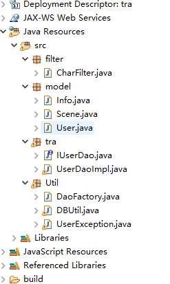
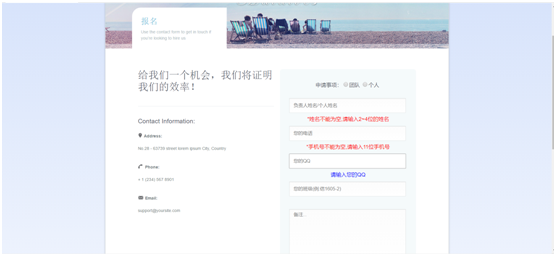
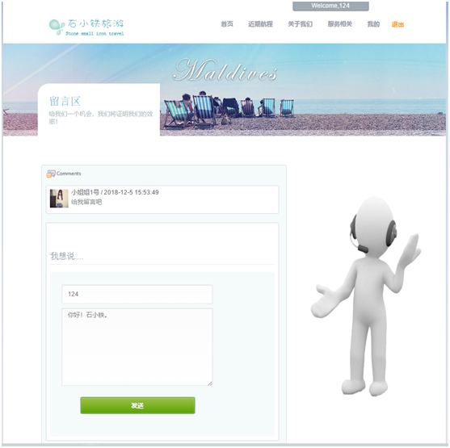
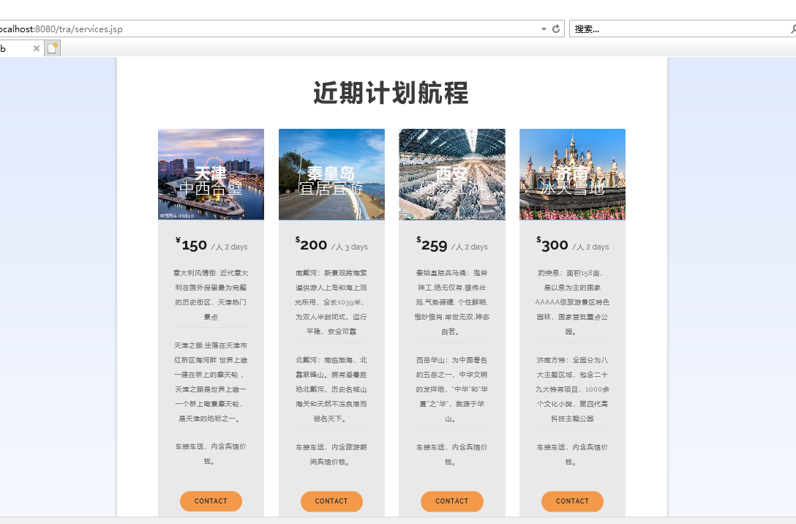
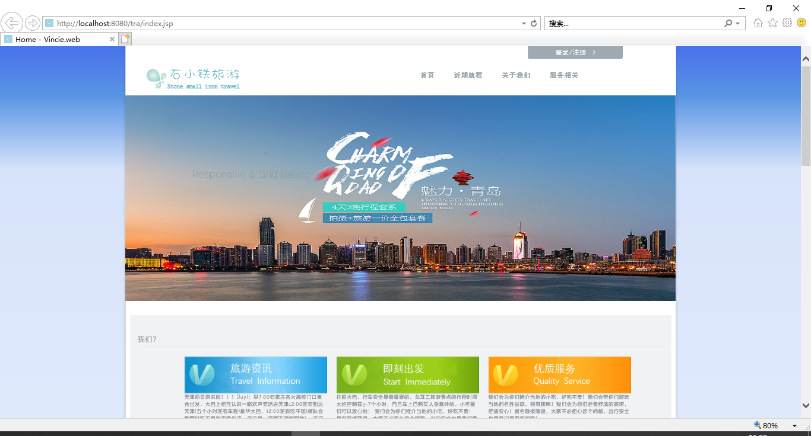

# TravelControlPlatForm
石小铁旅游管理平台（网页设计）
 

   
技术：<h3>JavaScript、Html、jQuery、Div+CSS、JSP、Bootstrap、PS</h3>

   
功能：
游客可以浏览，报名的话需要提前注册登录。
报名分为团体和个人，团体报名只需负责人进行报名，备注区标明几人报名
已注册登录的用户可以进行选择客服进行留言评论
旅游地点、时长、住宿、出行等事项管理员在“近期行程计划”页面给出
管理员定时上传计划旅游行程更新页面
宣传视频在“关于我们”页面已给出

 <h3>后台目录：</h3>
  
   <h3>页面展示：</h3>
  
   
  
   
   
  
  
网页设计

  
  
   
   

